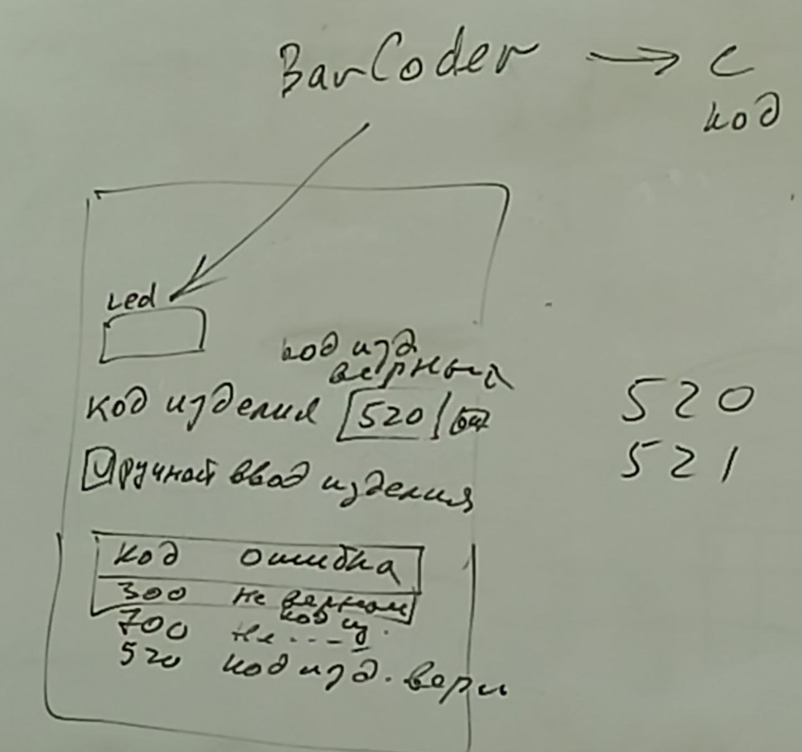

# Соревнования

Нужно отобрать 2 команды, если будет желающих слишком много, то будут проводится соревнования.

Перед началом работы дают 3.5 часов на проектирование в Word, объектно ореинтированная схема, информационные потоки (какие службы вызываются), описываются и рисуются в Word'e интерфейсы. <mark style="color:yellow;">Можно набрать много баллов.</mark>

### Задание 1: Организация сбора данных и управление удалёнными устройствами.

**Описание:** Необходимо разработать на платформе Thingworx, систему сбора данных с оборудования производственного модуля, а также создать веб-интерфейс инженера-технолога для отображения **ВСЕХ** поступаемых данных с оборудования. \
<mark style="color:yellow;">Нечем управлять не нужно, только выводить информацию и показывать критические значения.</mark>

**Необходимо:**

1. Организовать получение данных от оборудования гибкой производственной ячейки, с возможностью отключить получение данных;\
   (через свойство disable в элементах Mashup'а и Toggle флажок)
2. Реализовать систему хранения данных от оборудования с возможностью отключить сохранение данных\
   (в String через Stream, работает в Json формате)
3. Разработать веб-интерфейс автоматизированного рабочего места инженера-технолога.
4. Организовать вывод данных, полученных от оборудования, в веб интерфейс. (Отображать значения датчиков)\
   Cущественным является период времени от изменения состояния робота до отображения изменений на веб-интерфейсе.\
   (Имеется ввиду что требуется AutoRefresh)
5. Организовать преобразование данных с оборудования в корректные физические параметры
   * Угл поворота мотора `[m1]` `360/4096=0,0...` `0,0... * m1`
   * Нагрузка на моторы `[l1]` `100/4096 = 0,0...` `l1 * 0,0...`
6. Реализовать возможность ввода, в интерфейсе инженера-технолога, пороговых значений (критических, превышение которых может привести к аварийной ситуации) и допустимых (рабочих, имеющих смысл, получаемых от оборудования) значений параметров оборудования.
   * Ограничить передвижение робота по осям, x, y, z, и не давать ему двигаться дальше этих значений.
   * Также можно добавить ограничение по температуре.
   * Можно добавить в Mashup элементы Shape которые становятся красными когда что-то выходит за порог. (через Boolean поле)
7. Реализовать сохранение и отображение исключительных ситуаций, недопустимые параметры (выход за критические значения), неправильный код изделия, неверный формат данных.\
   (валдиация данных и отображение ошибок если что-то не так, нужно записывать всё в таблицу ошибок, но можно отображать и в под полем ввода ошибку)
8. Организовать настраиваемое хранение данных мониторинга функционирования гибкой производственной ячейки (полная настройка всех логов)
9. Реализовать табличный инструмент просмотра накопленных данных (в том числе логов) на интерфейсе инженера-технолога.
10. Разместить на веб интерфейсе средство сигнализации о критических значениях параметров оборудования и средство сигнализации о выходе параметров за границы установленных рабочих зон. (температура (0-40, 40-60, 60-100) и пункт 6)

## Задание 2:&#x20;

1. Создать веб интерфейс оператора, в соответствии со структурой, заданной при проектировании. (структура проектируется в Word)
2. Реализовать возможность ручного ввода значений всех необходимых параметров, для управляющих команд и их отправку. (NumericEntry `(SetProperties)`, Кнопка отправить, Робот перемещается на координаты которые задает оператор.) <mark style="color:yellow;">**(то есть должны быть элементы (кнопки, поля ввода) для управления вещами)**</mark>
   * Для светосигнальных ламп, должна присутствовать возможность включить любую конфигурацию ламп. <mark style="color:yellow;">**(возможность включить любые лампы у светофора, например через Shape)**</mark>
   * **Кодировка сигналов:**&#x20;
     1. **Постоянное свечение ламп:**&#x20;
        * Красный (аварийная ситуация);
        * Синий (выполнение команды роботом);
        * Зелёный (ожидание команды роботом);
        * Жёлтый (парковка);
     2. **Мигающая сигнализация ламп:**
        * Мигающий зелёный (штатно закончена сборка изделия);
        * Мигающий жёлтый (режим паузы сборки);
        * Мигающий красный (прервана или отменена сборка);


Мигающие сигналы не могут совмещаться (работать) одновременно, но могут совмещаться с постоянным свечением других цветов!


3. Обеспечить передачу устройством, гибкой производственной линии (все устройства которые есть на столе), управляющих команд. \
   При проверке работы будет контролироваться период времени, от нажатия кнопки отправки команды, до начала её выполнения. <mark style="color:yellow;">**(команды должны выполняться с минимальной задержкой)**</mark>
4. Выполнить калибровку системы управления роботами, через подбор координат размещения инструментов при оперировании деталями. <mark style="color:yellow;">**(найти координаты точек)**</mark>
5. Реализовать синхронную индикацию режимов работы роботов, с помощью светосигнальных ламп в автоматическом режиме. <mark style="color:yellow;">**(светофор должен корректно отображать текущий режим работы робота)**</mark>
6. <mark style="color:red;">**\***</mark> Реализовать включение и отключение автоматической (синхронной) индикации светосигнальных ламп, при которой индикация корректно сопровождает работу оборудования на площадке. <mark style="color:yellow;">**(отключение синхронизации робота и лампы, и выключение ламп)**</mark>
7. Реализовать на веб-интерфейсе оператора возможность POI -  управления при котором вводится в текстовое поле или выбирается из списка код заданной точки (целевая позиция) с возможностью перемещения в данную позицию, **также возможна реализация с размещением на веб интерфейсе множества кнопок (Shape) отвечающих за перемещение роботов в нужную позицию. **<mark style="color:yellow;">**(нажимаем на точку и робот к ней двигается)**</mark>
8. Обеспечить точное позиционирование инструментов роботов во всех целевых позициях через заданные кодов позиций. <mark style="color:yellow;">**(робот должен вставать ровно в центр, если люфты робота искажают результат то игнорирует их, ведь в этом виноват организатор)**</mark>
9. Реализовать возможность ввода кода изделия, а также получение его с [BarCoder](../code/parametry-veshei/skaner-kodov.md) (режим устанавливается переключателем), а также трансляцию кода в набор операций для оборудования гибкой производственной ячейки.\
   Набор операций представляется в текстовой или табличной форме на веб интерфейсе.\
   Также должно выводится сообщение о корректности или ошибочном получении кода. (например что кода нет в системе)

<figure><figcaption>
Изображение к пункту 9
</figcaption></figure>

10. Обеспечить полуавтоматическую сборку одного изделия. Такой режим подразумевает пошаговое выполнение операций с остановкой (паузой) после выполнения каждой операции. Запуск (и продолжение) обработки должен выполняться одной кнопкой на интерфейсе оператора. <mark style="color:yellow;">**(выбираем команду, также как делали с коммандой 250, 251, только по нажатию кнопки он переходит на следующее действие, нажали он сдвинулся, нажали ещё раз он опустился и так далее)**</mark>
11. Обеспечить автоматическую сборку изделия согласно номенколутуре. В веб интерфейс оператора должен позволять переключаться между автоматическим и полуавтоматическим режимом. <mark style="color:yellow;">**(переключение по кнопке. Автоматический - нажали на кнопку команды 250 и он полностью выполнился. Полуавтоматический - нажали на кнопку команды 250 и он выполнил только одно действие, ещё раз нажали и он выполнил следующее действие.)**</mark>
    * В автоматическом режиме код изделия должен с [сканера кода](../code/parametry-veshei/skaner-kodov.md). запуск сборки должен выполняться одной кнопкой на интерфейсе или кнопкой на пульте управления. Проверяется количество изделий, которое будет собранно верно.\
      Веб интерфейс оператора должен отображать планируемый порядок сборки изделия.
12. Релизовать индикацию завершения сборки изделия с подготовкой к следующей сборочной операции.
    * Индикация корректного завершения сборки - мигающий зеленый сигнал всех светофоров на поле.
    * Индикация ошибки при сборке - мигающий красный цвет всех светофоров на поле.&#x20;
    * Индикация паузы - мигающий жёлтый цвет всех светофоров на поле. (см.пункт 13)
13. Реализовать возможность приостановки сборки (паузы) при нажатии кнопки "пауза" на веб-интерфейсе оператора.
14. Обеспечить возможность запуска (или продолжение, если была приостановка) обработки с использованием кнопки на веб-интерфейсе оператора. \
    (продолжение пункта 13)
15. Реализовать возможность сброса сборки. <mark style="color:yellow;">**(Полная остановка сборки. Робот просто останавливается на месте, и ждёт нового кода. При получении нового кода Робот самостоятельно должен вернутся на парковку)**</mark>\
    После выполнения сброса, сборка может быть начата только сначала, и только при получении нового кода изделия. \
    Чтобы приложение начало новую сборку изделия с тем же кодом, необходимо передать код **0**. <mark style="color:yellow;">**(Под кодом 0 имеется ввиду парковка)**</mark>
16. Реализовать систему контроля безопасности, включая управление допустимыми и критическими значениями и реагирование (индикация) на достижение критических значений позиций рабочего инструмента - роботов манипуляторов.\
    Пороговые (критические) значения значения должны настраиваться через интерфейс.\
    <mark style="color:yellow;">**(Например если X координата робота больше 500 то отображаем на**</mark> [**мешапе** ](../thingworx-web/layout-mashup.md)<mark style="color:yellow;">**красный круг, иначе зелёный цвет. При этом число 500 должно настраиваться на мешапе)**</mark>\
    Также должны настраиваться допустимые значения. которые задают границы рабочих зон роботов.\
    Рабочие зоны двух роботов должны настраиваться независимо друг от друга.\
    <mark style="color:yellow;">**(Чтобы робот не мог ехать за попределённые значения, также нужно выводить сообщения об ошибке в таблицу/логи, что робот попытался куда то уехать)**</mark>
