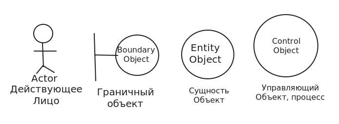

# Проектирование диограмм классов

## Введение

Для проектирования структуры системы используются диограммы классов

На этапе разработки диограммы классовой определяются основные сущности предметной области.

Каждый класс характеризуется свойствами (полями) и методами (функциями/сервисами)

Диограммы классов, традиционно, занимают центральное место в проекте. Это связанно с тем, что многие Case средства обладают возможностью генерировать программный код на основе диограмм классов. По этому имена классов, свойств и методов, часто записываются в нотации того языка программирования, на котором система будет реализована.&#x20;

## Схема диограмм

Для обозначения классов используется прямоугольник, в который включено несколько секций содержащих имя класса, имя свойств и методов.&#x20;

Кроме имён могут отображаться типы свойств, типы возвращаемые методами значений, и типы параметров методов (int, string, bool например)

Описывая свойства и методы, можно указать их область видимости с помощью модификаторов доступа или условных обозначений.\
public (+), private (-), protected (#), package (\~)

У метода InOut обозначено несколько общедоступных параметров, key и value. Так как он возвращает Json значение, а ключи и значения будут передаватся в строковом типе.

Кроме описание внутренних устройств классов, необходимо определить отношение между классами.

Самим общим видом отношений между классами является ассоциация.

На диограмме ассоциация изображается линией, соеденяющей классы. Концы этой линии могут быть снабжены информацией уточняющий характер связи, такой как видимость, роль, кратность.

Имя ассоциации может быть размещено в центре такой линии.

В качестве примера продемонстрируем связь между классами Robot и ControlProgram (управляющая программа). \
В производственной ячейке могут находится могут находится несколько манипуляторов, управляемых одной программой по этому концы линии, обозначающие отношения ассоциации, приведены в виде значков (`1` и `1*`) и названы `SendCommand` и `Execute`.\
Взаимодействие этих классов реализует автоматический режим сборки изделий, по этому ассоциация названа `AutoMode`.

## Отношения обобщения

Это отношения показывающее отношения между классами, при котором 1 из классов является более общим - предком, а другой его частным случаем.

При этом класс потомом наследует все (только public, protected, не наследуются private) свойста и поведения класса наследуемого объекта, принцип наследования лежит в основе ООП.

