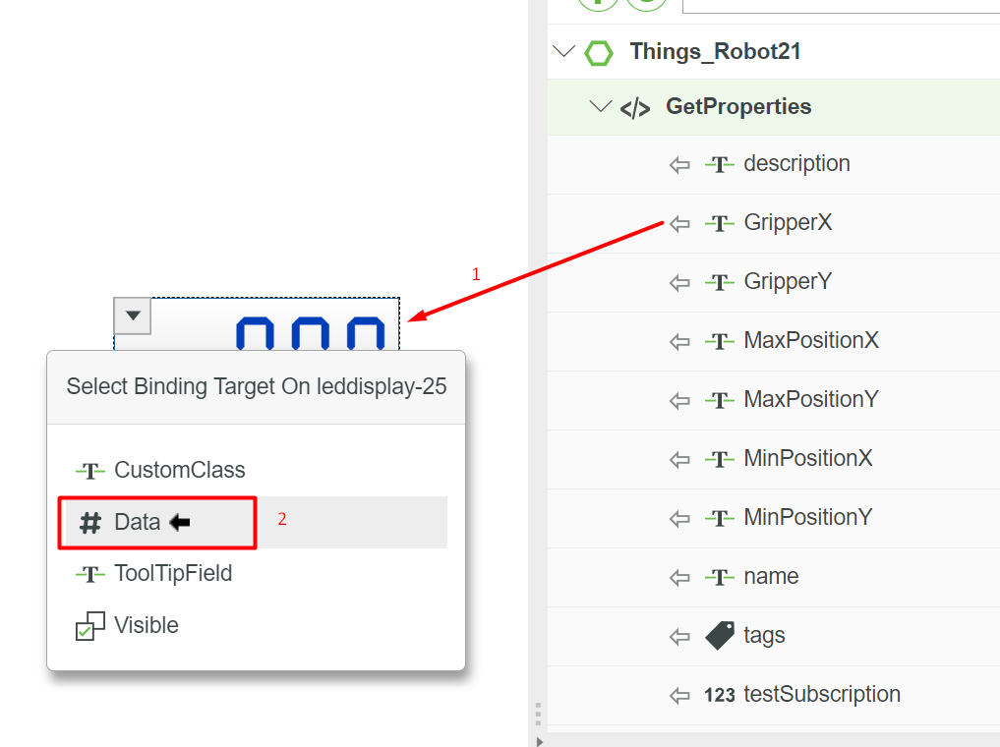

# Создание объектов

## Общее


**Для простоты понимания и отсутствия путаницы:**

Когда мне нужно будет назвать обобщение проектов, вещей, Shape'ов, Mashup'ов и прочего, я будут просто и лаконично писать слово <mark style="color:yellow;">**Объект**</mark>.&#x20;


Создание чего либо происходит через кнопку New c логотипом плюсика, в левом меню.

<figure><figcaption></figcaption></figure>

В этом меню вы можете создать любой объект какой хотите.

Также вы в поле `Set Project Context` вы можете указать проект по умолчанию, например если вы уже создали проект, то при указании в этом поле своего проекта, все создаваемые объекты будут создаваться именно в этом проекте.

Это позволяет не указывать кучу раз проект в настроках.

## Базовые параметры объектов

В любых объектах есть 5 параметра: Название, Описание, Документация, Проект и иногда Логотип.

<mark style="color:yellow;">**Название**</mark> <mark style="color:yellow;"></mark><mark style="color:yellow;">(</mark><mark style="color:yellow;">`Name`</mark><mark style="color:yellow;">)</mark> - это название вашего объекта. Оно не должно содержать пробелов. А также **название нельзя будет изменить после сохранения объекта.** Так что всегда, неважно что вы создаете, проверьте правильно ли вы ввели название. **ОСОБЕННО это касается** [**вещей**](sozdanie-obektov.md#veshi)**!**

<mark style="color:yellow;">**Описание**</mark> <mark style="color:yellow;"></mark><mark style="color:yellow;">(</mark><mark style="color:yellow;">`Description`</mark><mark style="color:yellow;">)</mark> - это короткое описание отображаемое в списке объектов (`Browse`). В описании например можно написать что это за объект, какой команде он пренадлежит. А если описание непосредственно проекта, то можно написать имена тех, кто состоит в вашей команде. Это просто полезное поле и оно не объязательно для заполнения.

<mark style="color:yellow;">**Документация**</mark> <mark style="color:yellow;"></mark><mark style="color:yellow;">(</mark><mark style="color:yellow;">`Documentation`</mark><mark style="color:yellow;">)</mark> - это действительно полезное поле, оно отображается только когда вы открываете объект. В это поле можно писать огромные объемы текста, которые позволят вам эффективнее работать. Например, в объекте Робота, в это поле вы можете написать все параметры управления и мониторинга, чтобы иметь их на быстром доступе. Это позволяет не искать где то в шпаргалке или в своих записях название, а смотреть непосредственно на странице вещи. Удобно.

<mark style="color:yellow;">**Проект**</mark> <mark style="color:yellow;"></mark><mark style="color:yellow;">(Project)</mark> - это проект в котором вы работаете. Любой объект (кроме проекта естественно) должен быть привязан к какому то проекту. По этому внимательнее в этом пункте и **указываем ИМЕННО СВОЙ проект.**&#x20;

<mark style="color:yellow;">**Логотип**</mark> - слева от названия бывает есть квадратное изображение. Если по нему нажать то вы можете указать свой собственный логотип для объекта. Просто для красоты и вашего удовлетворения :)&#x20;
